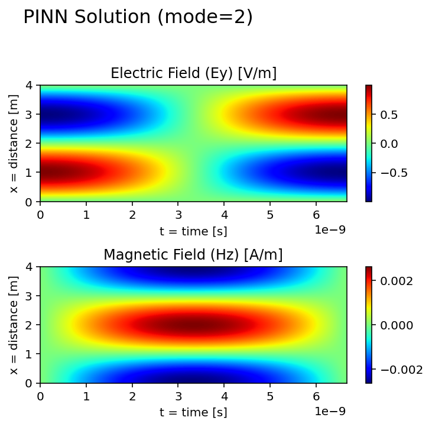

# 1D cavity model filled with homogeneous media (MODE 2)

 
<figure>
  
</figure>
 

**Analytical Solution, PINN Solution and Collocation Points for Training**

  
  
  

 

**Space-Time Propagation of Ey and Hz fields (based on PINN inferences)**
<figure>
  
</figure>
 

**Evolution of PINN Training Through Epochs (loops through 20000 epochs)**
<figure>
  
</figure>

:test_tube: &nbsp; [Explore results for different modes](../README.md)
